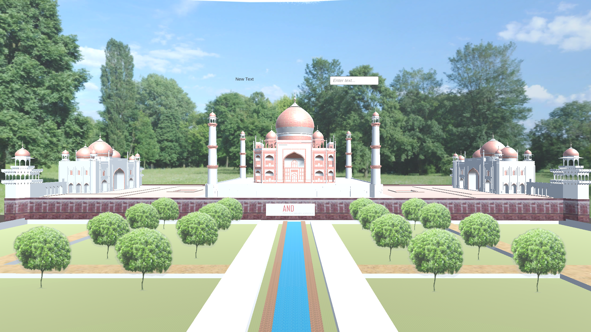

# 🌐 Virtual Reality and AI/ML Powered History Guides for Immersive education and Tourism



Welcome to the **VR Tour Guide** project! This repository contains a virtual reality application developed in Unity, integrated with a Rasa chatbot to provide an interactive, immersive tour experience. 

---

## 🏛️ Project Overview

The **VR Tour Guide** project is designed to create an immersive virtual reality experience where users can explore environments while interacting with a smart chatbot. The chatbot, powered by the Rasa framework, responds to user queries, provides information, and enhances the overall experience.

### 🎯 Key Features

- **Immersive VR Experience**: Explore virtual environments created in Unity.
- **Interactive Chatbot**: Get real-time responses from a Rasa-powered AI chatbot.
- **Seamless Integration**: Smooth communication between Unity and Rasa using HTTP requests.

---

## 🛠️ Technologies Used

- **Unity**: For developing the VR simulation.
- **Rasa**: For building the intelligent chatbot.
- **Python (Flask)**: For creating an API to connect Unity with the chatbot.
- **C#**: For scripting in Unity.
- **WebGL**: For deploying the Unity VR on the web.

---

## 🚀 Getting Started

### Prerequisites

- **Unity 2021+**
- **Python 3.7+**
- **Rasa 3.x**
- **Flask**

### Installation

1. **Clone the repository:**
   ```bash
   git clone https://github.com/your-username/vr-tour-guide.git
   cd vr-tour-guide
